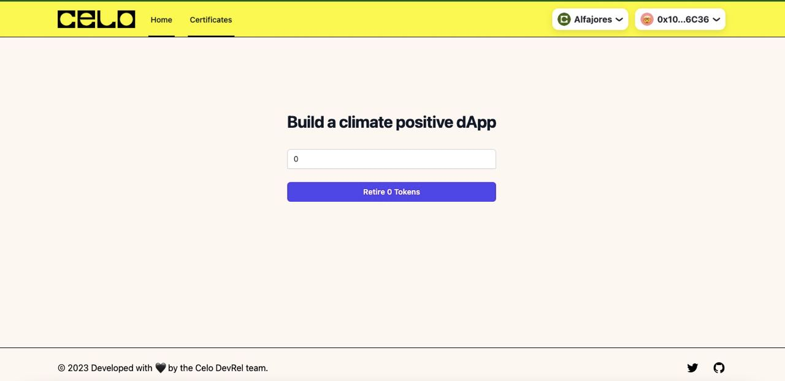

# Tutorial for Carbon retirement on Celo

In this Tutorial we will learn how to buid a carbon positive app on Celo, using Celo Composer and the Toucan SDK.

In the end the App will look like this.



1. Install [Celo-Composer](https://docs.celo.org/blog/2022/02/21/introduction-to-celo-progressive-dappstarter)

Now we have to options, depending on how far I finish it.

2. Either just interact with the [OffsetHelper](https://github.com/ToucanProtocol/OffsetHelper/blob/main/docs/OffsetHelper.md) contract or SDK

   2.1. Retiring carbon credits through the OffsetHelper  
   2.1.1. AutoOffset Pool Tokens  
   2.1.2. Get Contract  
   2.1.3. Call Contract function  
   2.2. Retiring carbon credits with the Toucan SDK  
   2.2.1. Install the SDK  
   2.2.2. Get Toucan Client  
   2.2.3. Interact with Toucan's Contracts  
   2.2.4. Retire Tokens with the OffsetHelper Contract
   2.3. Retire carbon credits with Toucans Contracts

3. Add the frontend

## 1. Install [Celo-Composer](https://docs.celo.org/blog/2022/02/21/introduction-to-celo-progressive-dappstarter)

To get started building out app, we will use the [Celo-Composer](https://docs.celo.org/blog/2022/02/21/introduction-to-celo-progressive-dappstarter) that already comes in with the wallet integration, wagmi hoogs and tailwind for styling.

## 2.1. Retiring carbon credits through the OffsetHelper

To retire carbo credits with the help of the OffsetHleper contract, we will use the wagmi hooks.

#### 2.1.1. AutoOffset Pool Tokens

The easiest way to retire is using the `autoOffsetPoolToken()` form the [OffsetHelper](https://github.com/ToucanProtocol/OffsetHelper/blob/main/docs/OffsetHelper.md) Contract. To call that function you will have to already have some NCT tokens. You can get some test-tokens in the [Toucan Faucet](https://faucet.toucan.earth/).

This function will

- redeem Toucan pool tokens for TCO2s
- retire these TCO2 tokens

```solidity
function autoOffsetPoolToken(address _poolToken, uint256 _amountToOffset) public;
```

#### 2.1.2. Get Contract

find the ABI and current address in the [`OffsetHelper/deployment`](https://github.com/ToucanProtocol/OffsetHelper/tree/main/deployments) folder.

create an `./abis` folder in the `react-app` folder and add the ABI.

import the abi into your `index.tsx` file.

```typescript
import offsetHelper from "../abis/OffsetHelper.json";
```

#### 2.1.3. Call Contract Function

If working directly with the [OffsetHelper](https://github.com/ToucanProtocol/OffsetHelper/blob/main/docs/OffsetHelper.md) Contract, we will use the `useContractWrite()` hook form [wagmi](https://wagmi.sh/react/hooks/useContractWrite) to interact with the contract.

```typescript
import { usePrepareContractWrite, useContractWrite } from "wagmi";

const { config } = usePrepareContractWrite({
  address: offsetHelper.address,
  abi: offsetHelper.abi,
  functionName: "autoOffsetPoolToken",
  args: [],
});

const { data, isLoading, isSuccess, write } = useContractWrite(config);
```

As Arguments for the function, you will need the current address of the pool token, that you want to retire, like NCT, which you can find on [this page](https://app.toucan.earth/contracts) with all deployed Toucan contracts. You will also need to input the amount of tokens you wish to retire.

```javascript
import { useState } from "react";

const NCTaddress = 0xfb60a08855389f3c0a66b29ab9efa911ed5cbcb5;
const [amountPoolToken, setAmountPoolToken] = useState(0);

const { config } = usePrepareContractWrite({
  address: offsetHelper.address,
  abi: offsetHelper.abi,
  functionName: "autoOffsetPoolToken",
  args: [NCTaddress, amountPoolToken],
});

const { data, isLoading, isSuccess, write } = useContractWrite(config);
```

### 2.2. Retiring carbon credits with the Toucan SDK

Using the Toucan SDK to retire Carbon Credits

#### 2.2.1. Install the SDK

```
npm i toucan-sdk
```

or

```
yarn add toucan-sdk
```

#### 2.2.2. Get Toucan Client

Instantiate the ToucanClient and set a signer & provider to interact with our infrastructure. We can use the signer & provider from the wagmi library

```typescript
import { ToucanClient } from "toucan-sdk";
import { useProvider, useSigner } from "wagmi";

const provider = useProvider();
const { data: signer, isError, isLoading } = useSigner();

const toucan = new ToucanClient("alfajores", provider, signer);
```

#### 2.2.3. Interact with Toucan's Contracts

You can find all deployed contracts on the [Toucan App](https://app.toucan.earth/contracts).

Now you can interact with them.

```typescript
const nct = toucan.getPoolContract("NCT");
const tco2 = toucan.getTCO2Contract(tco2Address);
const registry = toucan.getRegistryContract();
const offsetHelper = toucan.getOffsetHelperContract();
const remainingTCO2 = await bct.tokenBalances(tco2Address);
```

#### 2.2.4. Retire Tokens with the OffsetHelper Contract

```typescript
const NCTaddress = 0xfb60a08855389f3c0a66b29ab9efa911ed5cbcb5;
const [amountPoolToken, setAmountPoolToken] = useState(0);
const offsetHelper = toucan.getOffsetHelperContract();

const retireCarbon = async () => {
  const NCTaddress = 0xfb60a08855389f3c0a66b29ab9efa911ed5cbcb5;
  await offsetHelper.autoOffsetPoolToken(NCTaddress, amountPoolToken);
};
```

### 2.3. Retire carbon credits with Toucans Contracts

For interacting directly with the [Toucans Contracts](https://app.toucan.earth/contracts), we will use the `useContractWrite()` hook form [wagmi](https://wagmi.sh/react/hooks/useContractWrite).

We will have to do that, when we want to retire higher quality tokens.

```typescript
import { usePrepareContractWrite, useContractWrite } from "wagmi";
import poolTokencontract from "./abis/Contract.json";

const { config } = usePrepareContractWrite({
  address: poolTokencontract.address,
  abi: poolTokencontract.abi,
  functionName: "redeemAuto",
  args: [],
});

const { data, isLoading, isSuccess, write } = useContractWrite(config);
```

First you should get some pool tokens (e.g.NCTs) or TCO2 from the [Toucan Faucet](https://faucet.toucan.earth/). If you have NCTs, you will first have to redeem them for TCO2s. You will have to decide if you want to auto-redeem them, where they are exchanged for the lowest ranking TCO2s or you can get a list of all TCO2 with `getScoredTCO2s` and then select the ones you prefer and redeem them with `redemMany`. For this Toucan Protocol takes [fees](https://docs.toucan.earth/toucan/pool/protocol-fees).

After **_Redeeming_** your pool tokens you will be able to retire. You will need **TCOs** for that. You can either `retire` or if you would like to retire for a third party use the `retireFrom` function. Lastly you can also already get a certificate created with ` retireAndMintCertificate`.

If you want to create Certificates afterwards, you can als just do that with `mintCertificate`.

Please check the table for link to the docs for each specific contract. You can also find all current deployed contacts on the [Toucan App](https://app.toucan.earth/contracts).

| Contract                                                                                                          | Function                   | Description                                                                                                                                                                                                                                                                                              |
| ----------------------------------------------------------------------------------------------------------------- | -------------------------- | -------------------------------------------------------------------------------------------------------------------------------------------------------------------------------------------------------------------------------------------------------------------------------------------------------- |
| [PoolContracts (NCT/BCT)](https://docs.toucan.earth/toucan/dev-resources/smart-contracts/pool-contracts)          | `redeemAuto`               | Automatically redeems pool tokens for underlying TCO2 tokens. This is 1:1 and doesn't incur fees. But you will receive what are considered lower quality TCO2s based on an arbitrary index called scoredTCO2s (to be explained further down below). The user's pool tokens get burnt within the process. |
| [PoolContracts (NCT/BCT)](https://docs.toucan.earth/toucan/dev-resources/smart-contracts/pool-contracts)          | `redeemAuto2`              | `redeemAuto2` acts very similar to `redeemAuto` but it also returns arrays of the redeemed TCO2s. This uses more gas but it is going to be more optimal to use by other on-chain contracts.                                                                                                              |
| [PoolContracts (NCT/BCT)](https://docs.toucan.earth/toucan/dev-resources/smart-contracts/pool-contracts)          | `getScoredTCO2s`           | Returns an array of ranked TCO2 addresses. scoredTCO2s[0] being the lowest rank, the rank is then ascending. You want to call this function if you are planning to retire specific TCO2s. Or specifically TCO2s with a higher ranking.                                                                   |
| [PoolContracts (NCT/BCT)](https://docs.toucan.earth/toucan/dev-resources/smart-contracts/pool-contracts)          | `redeemMany`               | Selectively redeems pool tokens for underlying TCO2 tokens. This is 1:1 minus fees. The user's pool tokens get burnt within the process.                                                                                                                                                                 |
| [Toucan Carbon Offset](https://docs.toucan.earth/toucan/dev-resources/smart-contracts/tco2)                       | `retire`                   | You retire a given amount of CO2 tons. The tokens get burnt and this achieves the offset. This also emits a Retired event.                                                                                                                                                                               |
| [Toucan Carbon Offset](https://docs.toucan.earth/toucan/dev-resources/smart-contracts/tco2)                       | `retireFrom`               | Achieves similar functionality as retire(), but instead of retiring from the callers address, it does so from the given address. This allow for pools or third party contracts to retire for the user.                                                                                                   |
| [Toucan Carbon Offset](https://docs.toucan.earth/toucan/dev-resources/smart-contracts/tco2)                       | `retireAndMintCertificate` | Just as retire() this retires an amount of TCO2, but after the Retired event is emited this function mints a certificate passing the given retirementEventId.                                                                                                                                            |
| [Retirement Certificates](https://docs.toucan.earth/toucan/dev-resources/smart-contracts/retirement-certificates) | `mintCertificate`          | Mints a new RetirementCertificates NFT based on existent Retired events. The function can either be called by a valid TCO2 contract (in its retireAndMintCertificate() function) or by a user who owns Retired events.                                                                                   |

As Arguments for the function, you will need the current address of the pool token, that you want to retire, like NCT, which you can find on [this page](https://app.toucan.earth/contracts) with all deployed Toucan contracts. You will also need to input the amount of tokens you wish to retire. You can read more upon them in our [documentation](https://docs.toucan.earth/toucan/dev-resources/smart-contracts/pool-contracts).

```javascript
import { useState } from "react";

const NCTaddress = 0xfb60a08855389f3c0a66b29ab9efa911ed5cbcb5;
const [amountPoolToken, setAmountPoolToken] = useState(0);

const { config } = usePrepareContractWrite({
  address: offsetHelper.address,
  abi: offsetHelper.abi,
  functionName: "autoOffsetPoolToken",
  args: [NCTaddress, amountPoolToken],
});

const { data, isLoading, isSuccess, write } = useContractWrite(config);
```

## 3. Add the frontend

```tsx
return (
  <div>
    <div className="flex min-h-full items-center justify-center px-4 py-12 sm:px-6 lg:px-8">
      <input
        id="pool-token"
        name="amountPoolToken"
        type="number"
        required
        value={amountPoolToken}
        onChange={(e) => setAmountPoolToken(parseInt(e.target.value))}
      />
      <button type="submit" disabled={!write} onClick={() => write?.()}>
        {"Retire " + amountPoolToken + " Tokens"}
      </button>
      {isLoading && <div>Check Wallet</div>}
      {isSuccess && <div>Transaction: {JSON.stringify(data)}</div>}
    </div>
  </div>
);
```

<details>
<summary>Okay. Let's add some styling. Toggle to check out the finished code..</summary>

```tsx
return (
  <div>
    <div className="flex min-h-full items-center justify-center px-4 py-12 sm:px-6 lg:px-8">
      <div className="w-full max-w-md space-y-8">
        <div>
          <h2 className="mt-6 text-center text-3xl font-bold tracking-tight text-gray-900">
            Build a climate positive dApp{" "}
          </h2>
        </div>
        <form className="mt-8 space-y-6" action="#" method="POST">
          <div className="-space-y-px rounded-md shadow-sm">
            <div>
              <label htmlFor="email-address" className="sr-only">
                Amount of pool tokens (NCT) you want to retire
              </label>
              <input
                id="pool-token"
                name="amountPoolToken"
                type="number"
                required
                className="relative block w-full rounded-t-md border-0 py-1.5 text-gray-900 ring-1 ring-inset ring-gray-300 placeholder:text-gray-400 focus:z-10 focus:ring-2 focus:ring-inset focus:ring-indigo-600 sm:text-sm sm:leading-6"
                value={amountPoolToken}
                onChange={(e) => setAmountPoolToken(parseInt(e.target.value))}
              />
            </div>
          </div>

          <div>
            <button
              type="submit"
              className="group relative flex w-full justify-center rounded-md bg-indigo-600 px-3 py-2 text-sm font-semibold text-white hover:bg-indigo-500 focus-visible:outline focus-visible:outline-2 focus-visible:outline-offset-2 focus-visible:outline-indigo-600"
              disabled={!write}
              onClick={() => write?.()}
            >
              <span className="absolute inset-y-0 left-0 flex items-center pl-3"></span>
              {"Retire " + amountPoolToken + " Tokens"}
            </button>
            {isLoading && <div>Check Wallet</div>}
            {isSuccess && <div>Transaction: {JSON.stringify(data)}</div>}
          </div>
        </form>
      </div>
    </div>
  </div>
);
```

</details>
