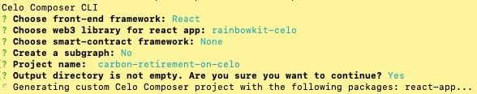
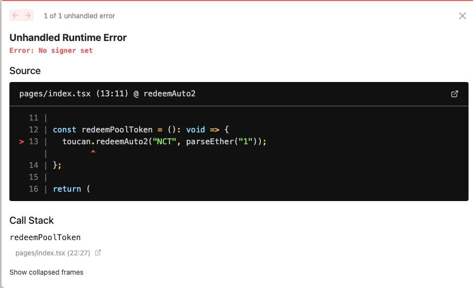

# Tutorial for Carbon retirement on Celo using Toucan SDK

Climate change is real, and thinking of our carbon footprint when building software should be part of the planning process as much as thinking about the architecture. One blockchain that is leading in this regard is Celo blockchain, and they are even offsetting more carbon than they are producing. And if your choice of network to build your application on was Celo, you already made a step in the right direction. But other actions can increase your or your users carbon footprint and, in this tutorial, you will learn how to account for that in a few lines of code and create a carbon positive app. If you are new to carbon credit retirements and what kind of infrastructure tools Toucan provides, make sure to read up on it in their [blog](https://blog.toucan.earth/toucan-9-faqs/#infrastructure).

And now lets start building 🏗

### Prerequisites

To start building, you’ll need a basic understanding of web development, Node (v12), yarn, and Git.

- Node

- Yarn

- Git

### Tools we will use:

- [Celo-Composer](https://github.com/celo-org/celo-composer)

- [Toucan SDK](https://github.com/ToucanProtocol/toucan-sdk)

Okay. What will learn in this tutorial in detail? We will use Celo-composer to quikstart a web3 frontend-dApp, install the Toucan SDK. Then we will get some Nature Carbon Tonnes (NCTs). We can get them at a decentralized exchange (DEX) like [Ubeswap](https://ubeswap.org). Then we will redeem them for TCO2s (which are tokenized carbon credits and are one-to-one linked to a credit issued by a conventional registry, and has its unique attributes (like project, vintage or methodology) attached. These tokens can then be retired, and you can receive a certificate to proof the retirement). In the end we will also learn how to get all data related to tokens and retirements through querying the [subgraph](https://thegraph.com/hosted-service/subgraph/toucanprotocol/alfajores).

By the end of this tutorial, you will know

- how to redeem NCT for TCO2

- how to retire TCO2

- how to query the subgraph to get details on tokens, retirements and certificates

Great!!! Let's get started!!!

1. Install Celo-Composer

2. Retire Carbon Credits with the Toucan SDK

   2.1. Install the SDK

   2.2. Get the Toucan Client

   2.3. Redeem Tokens form a PoolContract (e.g., NCT)

   2.4. Retire TCO2s

3. Creating a list of our retirements

## 1. Install [Celo-Composer](https://docs.celo.org/blog/tutorials/building-our-first-smart-contract-web-dapp-with-celo-composer)

We will use [Celo-Composer](https://docs.celo.org/blog/tutorials/building-our-first-smart-contract-web-dapp-with-celo-composer) to quick-start our web3 application. It already comes with several wallet integrations using [rainbow-kit](https://www.rainbowkit.com), [wagmi](https://wagmi.sh) for easy interactions with the blockchain and [tailwind](https://tailwindcss.com) for styling.

```

npx @celo/celo-composer create

```

To create a simple example project, we just chose the default, except for `Choose smart-contract framework:`, there we choose `none` as we won't need to develop smart contracts if we only want to use the Toucan SDK.



Great. Now let's open the project in our favorite IDE (e.g., VS Code).

First navigate into the react-app.

```

cd packages/react-app/

```

Here install all dependencies with

```

npm i

```

or

```

yarn

```

---

And finally, let's start the App and see if everything is running.

```

npm run dev

```

or

```

yarn run dev

```

---

## 2. Retire Carbon Credits

Next, we are going to retire carbon credits on Celo using the [Toucan SDK](https://github.com/ToucanProtocol/toucan-sdk). The Toucan SDK provides you with tools to simply implement carbon retirements into your app with just a few lines of code. It also provides some pre-defined subgraph queries but offers you the freedom to create any query your heart desires to get all the info about all retirements and tokens.

## 2.1. Install the SDK

Add the Toucan SDK.

```

npm i toucan-sdk@1.0.0-beta

```

or

```

yarn add toucan-sdk@1.0.0-beta

```

## 2.2. Get Toucan Client

When using the Toucan SDK, we want to first instantiate the ToucanClient and set a signer & provider to interact with our infrastructure. We can use the signer & provider from the wagmi library. For interacting with The Graph, no provider or signer is needed though. But we will talk about that [later](#3-creating-a-list-of-our-retirements).

So in the `index.tsx` file we will add the imports to the top:

```typescript
import ToucanClient from "toucan-sdk";
import { useProvider, useSigner } from "wagmi";
```

And this part into our function body

```typescript
const provider = useProvider();
const { data: signer, isError, isLoading } = useSigner();
const toucan = new ToucanClient("alfajores", provider);
signer && toucan.setSigner(signer);
```

<details>

<summary>Our code will look like this now:</summary>

```javascript
import ToucanClient from "toucan-sdk";
import { useProvider, useSigner } from "wagmi";

export default function Home() {
  const provider = useProvider();
  const { data: signer, isError, isLoading } = useSigner();
  const toucan = new ToucanClient("alfajores", provider);
  signer && toucan.setSigner(signer);

  return (
    <div>
      <div className="h1">
        There we go... a canvas for your next Celo project!
      </div>
    </div>
  );
}
```

</details>

## 2.3. Redeem Tokens form a PoolContract (e.g., NCT)

To retire Carbon Credits, we need pool tokens (e.g., NCTs) or TCO2s. We can get them from the [Toucan Faucet](https://faucet.toucan.earth/). In this example we will get NCT, as these are the tokens, we can buy in an exchange like Ubeswap.

What is the difference between NCTs and TCO2s: Simply put, TCO2s are tokenized carbon credits. While NCT are the first carbon reference tokens created on Toucans infrastructure and are stripped of most attributes. As a user you will only have TCO2 tokens, if you tokenized carbon credits yourself or if you have already redeemed NCTs for TCO2s. So, this example will start with NCTs.

| :herb: Get some Nature Carbon Tonnes (NCT) form the [Toucan Faucet](https://faucet.toucan.earth/) before you continue. Make sure you have CELO to pay the gas fee for the withdrawal, you can get some from the [Celo Faucet](https://faucet.celo.org/alfajores). :herb: |
| ------------------------------------------------------------------------------------------------------------------------------------------------------------------------------------------------------------------------------------------------------------------------ |

We can auto-redeem the Pool tokens with [`toucan.redeemAuto2`](https://docs.toucan.earth/toucan/dev-resources/smart-contracts/pool-contracts#redeemauto2), where they are exchanged for the lowest ranking TCO2s. Auto-redeem also returns the addresses of the redeemed TCO2s, which we need for the next step. As arguments for the function, we will need the current address of the pool symbol, that we want to retire, like "NCT". We will also need to input the amount of tokens we wish to retire. You can read more upon the functions in our [documentation](https://docs.toucan.earth/toucan/dev-resources/smart-contracts/pool-contracts).

If we want to choose the TCO2s that we want to retire, we can get a list of all TCO2s with `toucan.getScoredTCO2s` and then select the ones we prefer. Currently scored TCO2 means, that the tokens are sorted by year with `scoredTokens[0]` being the lowest. Using the Toucan SDK, you can get more info on each of the tokens though querying the subgraph (as described in the next part), and decide on your own criteria, based on the newly released [Core Carbon Principals](https://blog.toucan.earth/core-carbon-principles/). When choosing the TCO2 you want to retire, make sure that the balance of the token is not 0. After having chosen TCO2s we want to retire, (we can choose several) we can redeem them with `toucan.redeemMany`. For this Toucan Protocol takes fees. We can calculate the fee beforehand with `toucan.calculateRedeemFees`.

But today we stay simple with `redeemAuto2`. You cannot redeem less than 1 NCT in one transaction:

```typescript
await toucan.redeemAuto2("NCT", parseEther("1"));
```

Now let's put that code in a function and add a button to trigger it, so we can see it in action!! We also want to store the return value, the TCO2 address in a variable, as we will want to use it in the next step.

<details>

<summary>Our code should look like this now: </summary>

```typescript
import { parseEther } from "ethers/lib/utils.js";
import ToucanClient from "toucan-sdk";
import { useProvider, useSigner } from "wagmi";

export default function Home() {
  const provider = useProvider();
  const { data: signer, isError, isLoading } = useSigner();
  const toucan = new ToucanClient("alfajores", provider);
  signer && toucan.setSigner(signer);

  // we will store our return value here
  const [tco2address, setTco2address] = useState("");

  const redeemPoolToken = async (): Promise<void> => {
    const redeemedTokenAddress = await toucan.redeemAuto2(
      "NCT",
      parseEther("1")
    );

    redeemedTokenAddress && setTco2address(redeemedTokenAddress[0].address);
  };

  return (
    <div>
      <div className="h1">
        <div>
          <button
            className="group relative flex w-full justify-center rounded-md bg-indigo-600 px-3 py-2 text-sm font-semibold text-white hover:bg-indigo-500 focus-visible:outline focus-visible:outline-2 focus-visible:outline-offset-2 focus-visible:outline-indigo-600"
            onClick={() => redeemPoolToken()}
          >
            <span className="absolute inset-y-0 left-0 flex items-center pl-3"></span>

            {"Redeem Tokens"}
          </button>
        </div>{" "}
      </div>
    </div>
  );
}
```

</details>

But we will probably get an error like this:



And that makes sense, because we are not yet connected with our wallet. So, let's click that Wallet Connect button.

| :eyeglasses: Try it out and check the transaction on [Celoscan](https://alfajores.celoscan.io) :eyeglasses: |
| ----------------------------------------------------------------------------------------------------------- |

## 2.4. Retire TCO2s

After **_Redeeming_** our pool tokens for TCO2s we will be able to retire them. We can only retire **TCO2** tokens. We can either choose to simply [`retire`](https://docs.toucan.earth/toucan/dev-resources/smart-contracts/tco2#retire) or if we would like to retire for a third party use the [`retireFrom`](https://docs.toucan.earth/toucan/dev-resources/smart-contracts/tco2#retirefrom) function. Lastly, we can also already get a certificate created with [` retireAndMintCertificate`](https://docs.toucan.earth/toucan/dev-resources/smart-contracts/tco2#retireandmintcertificate). - [Example ABI](https://github.com/ToucanProtocol/contracts/blob/main/artifacts/staging/celo-alfajores/ToucanCarbonOffsets.json)

The first thing we will have to do, will be to get the address of our TCO2 token. We will have saved that as return value form `autoRedeem2` or from when we selected the tokens. And now we can retire our token, with adding this line of code to our redeem function.

```typescript
await toucan.retire(parseEther("1.0"), tco2Address);
```

Let's create a second function called `retirePoolToken` as well as a button for the retirement process.

<details>

<summary>Our code should look like this now: </summary>

```tsx
import { parseEther } from "ethers/lib/utils.js";
import { useState } from "react";
import ToucanClient from "toucan-sdk";
import { useProvider, useSigner } from "wagmi";

export default function Home() {
  const provider = useProvider();
  const { data: signer, isError, isLoading } = useSigner();
  const toucan = new ToucanClient("alfajores", provider);
  signer && toucan.setSigner(signer);

  const [tco2address, setTco2address] = useState("");

  const redeemPoolToken = async (): Promise<void> => {
    const redeemedTokenAddress = await toucan.redeemAuto2(
      "NCT",

      parseEther("1")
    );

    redeemedTokenAddress && setTco2address(redeemedTokenAddress[0].address);
  };

  const retireTCO2 = async (): Promise<void> => {
    tco2address.length && (await toucan.retire(parseEther("1.0"), tco2address));
  };

  return (
    <div>
      <div className="h1">
        <div>
          <button
            className="group relative flex w-full justify-center rounded-md bg-indigo-600 px-3 py-2 text-sm font-semibold text-white hover:bg-indigo-500 focus-visible:outline focus-visible:outline-2 focus-visible:outline-offset-2 focus-visible:outline-indigo-600"
            onClick={() => redeemPoolToken()}
          >
            <span className="absolute inset-y-0 left-0 flex items-center pl-3"></span>

            {"Redeem Tokens"}
          </button>

          <button
            className="group relative flex w-full justify-center rounded-md bg-indigo-600 px-3 py-2 text-sm font-semibold text-white hover:bg-indigo-500 focus-visible:outline focus-visible:outline-2 focus-visible:outline-offset-2 focus-visible:outline-indigo-600"
            onClick={() => retireTco2Token()}
          >
            <span className="absolute inset-y-0 left-0 flex items-center pl-3"></span>

            {"Retire Tokens"}
          </button>
        </div>{" "}
      </div>
    </div>
  );
}
```

</details>

| :eyeglasses: Try it out and check the transaction on [Celoscan](https://alfajores.celoscan.io) :eyeglasses: |
| ----------------------------------------------------------------------------------------------------------- |

# 3. Creating a list of our retirements

In the last step, we are creating a list showing our retirements. First, we will create a new `list.tsx` page.

There we need the `ToucanClient`. This time we won't need a provider or signer as we are only querying the subgraph.

```typescript
const toucan = new ToucanClient("alfajores");
```

The Toucan SDK has several pre-defined queries to get data from the subgraph, but we can also create our customized query with `toucan.fetchCustomQuery()`. We can check all schemes, create and test our query in the [playground](https://thegraph.com/hosted-service/subgraph/toucanprotocol/alfajores) of the Toucan Subgraph.

Now we will use one of the predefined queries to get a list of our retirements.
We will need the users address for that, so let's use the wagmi `useAccount` hook for that.

```typescript
const { address } = useAccount();
```

Remember that an address always needs to be lower case for querying, otherwise we won't get any results.

```typescript
await toucan.fetchUserRetirements(address?.toLowerCase());
```

Now let's add some code to display out retirements in a table.

<details>

<summary>And now our code should look like this now: </summary>

```tsx
import { useEffect, useState } from "react";
import ToucanClient, { fetchUserRetirementsResult } from "toucan-sdk";
import { useAccount } from "wagmi";

export default function Sdk() {
  const toucan = new ToucanClient("alfajores");
  const { address } = useAccount();
  const [retirements, setRetirements] = useState<fetchUserRetirementsResult[]>(
    []
  );

  const getUserRetirements = async () => {
    const result =
      address && (await toucan.fetchUserRetirements(address?.toLowerCase()));

    result && setRetirements(result);
  };

  useEffect(() => {
    !retirements.length && getUserRetirements();
  });

  return (
    <div>
      <div className="flex min-h-full items-center justify-center px-4 py-12 sm:px-6 lg:px-8">
        <div className="w-full space-y-8">
          <div className="">
            <h2 className="mt-6 text-center text-3xl font-bold tracking-tight text-blue-900">
              My Retirements{" "}
            </h2>
          </div>

          <div className="flex justify-center"></div>

          {retirements.length ? (
            <div className="relative overflow-x-auto">
              <table className="w-full text-sm text-left text-blue-500 dark:text-blue-400">
                <thead className="text-xs text-blue-700 uppercase bg-blue-50 dark:bg-blue-700 dark:text-blue-400">
                  <tr>
                    <th className="px-6 py-3">Token name</th>

                    <th className="px-6 py-3">Token symbol</th>

                    <th className="px-6 py-3">Certificate ID</th>

                    <th className="px-6 py-3">Creation Transaction</th>
                  </tr>
                </thead>

                <tbody>
                  {retirements.map((item) => {
                    return (
                      <tr
                        className="bg-white border-b dark:bg-blue-800 dark:border-blue-700"
                        key={item.id}
                      >
                        <td className="px-6 py-4 font-medium text-blue-900 whitespace-nowrap dark:text-white">
                          {item.token.name}
                        </td>

                        <td className="px-6 py-4">{item.token.symbol}</td>

                        <td className="px-6 py-4">{item.certificate?.id}</td>

                        <td className="px-6 py-4">{item.creationTx}</td>
                      </tr>
                    );
                  })}
                </tbody>
              </table>
            </div>
          ) : (
            <div>You don't have retired any carbon credits yet</div>
          )}
        </div>
      </div>
    </div>
  );
}
```

</details>
