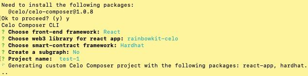

# Tutorial for Carbon retirement on Celo

In this Tutorial you will learn how retire carbon credits on Celo, using Celo Composer and the Toucan SDK. For that we need to get carbon Pool tokens like NCTs, redeem them for TCO2s (that represent carbon credits with all their information) and then retire those.
In the end we will also learn how to query the subgraph, when building a page to show the users retirements.

1. Install Celo-Composer
2. Retire Carbon Credits: Either use the Toucan SDK or interact directly with the Toucan Contracts

   2. Install the SDK  
      2.2. Get Toucan Client  
      2.3. Redeem Tokens form a PoolContract (e.g. NCT)  
      2.4. Retire your TCO2s  
      2.5. Get a certificate  
      2.6. Interact with Toucan's Contracts

3. Creating a list of our retirements

## 1. Install [Celo-Composer](https://docs.celo.org/blog/tutorials/building-your-first-smart-contract-web-dapp-with-celo-composer)

You will use [Celo-Composer](https://docs.celo.org/blog/tutorials/building-your-first-smart-contract-web-dapp-with-celo-composer) to quick-start our web3 application. It already comes with several wallet integrations using [rainbow-kit](https://www.rainbowkit.com), [wagmi](https://wagmi.sh) for easy interactions with the blockchain and [tailwind](https://tailwindcss.com).

```
npx @celo/celo-composer create
```

To create a simple example project I just chose the default.



Great. Now let's open the project in your favorite IDE (e.g. VS Code).

First navigate into the react-app.

```
cd packages/react-app/
```

Here install all dependencies with

```
npm i
```

or

```
yarn;
```

---

And finally, let's start the App and see if everything is running.

```
npm run dev
```

or

```
yarn run dev
```

---

## 2. Retire Carbon Credits

Next you are going to retire carbon credits on Celo using the Toucan SDK.

## 2.1. Install the SDK

Add the Toucan SDK.

```
npm i toucan-sdk
```

or

```
yarn add toucan-sdk
```

## 2.2. Get Toucan Client

When using the Toucan SDK you want to first instantiate the ToucanClient and set a signer & provider to interact with our infrastructure. You can use the signer & provider from the wagmi library. For interacting with The Graph, no provider or signer is needed though. But you will talk about that [later](#3-creating-a-list-of-our-retirements).

So in the `index.tsx` file you will add the imports to the top:

```typescript
import { ToucanClient } from "toucan-sdk";
import { useProvider, useSigner } from "wagmi";
```

And this part into our function body

```typescript
const provider = useProvider();
const { data: signer, isError, isLoading } = useSigner();

const toucan = new ToucanClient("alfajores", provider);
signer && toucan.setSigner(signer);
```

<details>
<summary>Our code will look like this now:</summary>

```javascript
import { ToucanClient } from "toucan-sdk";
import { useProvider, useSigner } from "wagmi";

export default function Home() {
  const provider = useProvider();
  const { data: signer, isError, isLoading } = useSigner();

  const toucan = new ToucanClient("alfajores", provider);
  signer && toucan.setSigner(signer);
  return (
    <div>
      <div className="h1">
        There you go... a canvas for your next Celo project!
      </div>
    </div>
  );
}
```

</details>

## 2.3. Redeem Tokens form a PoolContract (e.g. NCT)

To retire Carbon Credits need pool tokens (e.g.NCTs) or TCO2. You can get them from the [Toucan Faucet](https://faucet.toucan.earth/). You should get NCT, as theses are the tokens you can buy in an exchange like Ubeswap. You will only have TCO2 tokens, if you tokenzied carbon credits yourself or if you have already redeemed the NCTs for TCO2s. So this example will start with NCTs.

| :herb: Get some Nature Carbon Tonnes (NCT) before you continue form the [Toucan Faucet](https://faucet.toucan.earth/) . Make sure you have CELO to pay the gas fee for the withdrawel, you can get some from the [Celo Faucet](https://faucet.celo.org/alfajores). :herb: |
| ------------------------------------------------------------------------------------------------------------------------------------------------------------------------------------------------------------------------------------------------------------------------- |

You can auto-redeem the Pool tokens with [`redeemAuto2`](https://docs.toucan.earth/toucan/dev-resources/smart-contracts/pool-contracts#redeemauto2), where they are exchanged for the lowest ranking TCO2s. Auto-redeem also returns the addresses of the redeemed TCO2s, which you need for the next step. As arguments for the function, you will need the current address of the pool symbol, that you want to retire, like "NCT". You will also need to input the amount of tokens you wish to retire. You can read more upon the functions in our [documentation](https://docs.toucan.earth/toucan/dev-resources/smart-contracts/pool-contracts).

If you want to choose the TCO2s that you want to retire, you can get a list of all TCO2 with `getScoredTCO2s` and then select the ones you prefer. When getting the highest TCO2, make sure that the balance of the token is not 0. When you've chosen then ones you want to redeem your pool tokens for (you can choose several) you can redeem them with `redemMany`. For this Toucan Protocol takes fees. You can calculate the fee beforehand with `calculateRedeemFees`.

But today we stay simple with `redeemauto2`:

```typescript
toucan.redeemAuto2("NCT", parseEther("1"));
```

Now let's put that code in a function and add a button to trigger it, so you can see it in action!! You also want to store the return value, the TCO2 address in a variable, as you will want to use it in the next step.

<details>
<summary>Our code should look like this now: </summary>

```typescript
import { parseEther } from "ethers/lib/utils.js";
import { ToucanClient } from "toucan-sdk";
import { useProvider, useSigner } from "wagmi";

export default function Home() {
  const provider = useProvider();
  const { data: signer, isError, isLoading } = useSigner();
  const toucan = new ToucanClient("alfajores", provider);
  signer && toucan.setSigner(signer);
  // you will store our return value here
  const [tco2address, setTco2address] = useState("");

  const redeemPoolToken = async (): Promise<void> => {
    const redeemedTokenAddress = await toucan.redeemAuto2(
      "NCT",
      parseEther("1")
    );
    redeemedTokenAddress && setTco2address(redeemedTokenAddress[0].address);
  };

  return (
    <div>
      <div className="h1">
        <div>
          <button
            className="group relative flex w-full justify-center rounded-md bg-indigo-600 px-3 py-2 text-sm font-semibold text-white hover:bg-indigo-500 focus-visible:outline focus-visible:outline-2 focus-visible:outline-offset-2 focus-visible:outline-indigo-600"
            onClick={() => redeemPoolToken()}
          >
            <span className="absolute inset-y-0 left-0 flex items-center pl-3"></span>
            {"Redeem Tokens"}
          </button>
        </div>{" "}
      </div>
    </div>
  );
}
```

</details>

But you will probably get an error like this:


And that makes sense, because you are not yet connected with our wallet. So let's do that.

| :eyeglasses: Try it out and check the transaction on [Celoscan](https://alfajores.celoscan.io) :eyeglasses: |
| ----------------------------------------------------------------------------------------------------------- |

## 2.4. Retire your TCO2s

After **_Redeeming_** your pool tokens for TCO2s you will be able to retire them. You can only retire **TCO2s** tokens. You can either choose to simply [`retire`](https://docs.toucan.earth/toucan/dev-resources/smart-contracts/tco2#retire) or if you would like to retire for a third party use the [`retireFrom`](https://docs.toucan.earth/toucan/dev-resources/smart-contracts/tco2#retirefrom) function. Lastly you can also already get a certificate created with [` retireAndMintCertificate`](https://docs.toucan.earth/toucan/dev-resources/smart-contracts/tco2#retireandmintcertificate). - [Example ABI](https://github.com/ToucanProtocol/contracts/blob/main/artifacts/staging/celo-alfajores/ToucanCarbonOffsets.json)

The first thing you will have to do, will be to get the address of your TCO2 token. You will have saved that as return value form `autoRedeem2` or from when you selected the tokens. And now you can retire our token, with adding this line of code to our redeem function.

```typescript
await toucan.retire(parseEther("1.0"), tco2Address);
```

Let's rename our function to `retirePoolToken` as well as the button to match the actual action that you are doing.

<details>
<summary>Our code should look like this now: </summary>

```tsx
import { parseEther } from "ethers/lib/utils.js";
import { useState } from "react";
import { ToucanClient } from "toucan-sdk";
import { useProvider, useSigner } from "wagmi";

export default function Home() {
  const provider = useProvider();
  const { data: signer, isError, isLoading } = useSigner();
  const toucan = new ToucanClient("alfajores", provider);
  signer && toucan.setSigner(signer);
  const [tco2address, setTco2address] = useState("");

  const retirePoolToken = async (): Promise<void> => {
    const redeemedTokenAddress = await toucan.redeemAuto2(
      "NCT",
      parseEther("1")
    );
    redeemedTokenAddress && setTco2address(redeemedTokenAddress[0].address);

    tco2address.length && (await toucan.retire(parseEther("1.0"), tco2address));
  };

  return (
    <div>
      <div className="h1">
        <div>
          <button
            className="group relative flex w-full justify-center rounded-md bg-indigo-600 px-3 py-2 text-sm font-semibold text-white hover:bg-indigo-500 focus-visible:outline focus-visible:outline-2 focus-visible:outline-offset-2 focus-visible:outline-indigo-600"
            onClick={() => retirePoolToken()}
          >
            <span className="absolute inset-y-0 left-0 flex items-center pl-3"></span>
            {"Retire Tokens"}
          </button>
        </div>{" "}
      </div>
    </div>
  );
}
```

</details>

# 3. Creating a list of our retirements

In the last step, let's create a list showing our retirements. First you will create a new `list.tsx` page.

There you need the ToucanClient. But, you won't need a provider or signer for querying the subgraph.

```typescript
const toucan = new ToucanClient("alfajores");
```

The Toucan SDK has several pre-defined queries to get data from the subgraph, but you can also create your customized query with `toucan.fetchCustomQuery()`.

But now you will use one of the predefined queries to get a list of our retirements. Remember that an address always needs to be lower case for querying, otherwise you won't get any results.

```typescript
await toucan.fetchUserRetirements(address?.toLowerCase());
```

Now let's add some code to display out retirements in a table.

<details>
<summary>And now our code should look like this now: </summary>

```tsx
import { useEffect, useState } from "react";
import { ToucanClient } from "toucan-sdk";
import { useAccount } from "wagmi";

export default function Sdk() {
  const toucan = new ToucanClient("alfajores");
  const { address } = useAccount();

  const [retirements, setRetirements] = useState([]);

  useEffect(() => {
    !retirements.length && getUserRetirements();
  });

  const getUserRetirements = async () => {
    const result = await toucan.fetchUserRetirements(address?.toLowerCase());
    result && setRetirements(result);
  };

  return (
    <div>
      <div className="flex min-h-full items-center justify-center px-4 py-12 sm:px-6 lg:px-8">
        <div className="w-full space-y-8">
          <div className="">
            <h2 className="mt-6 text-center text-3xl font-bold tracking-tight text-blue-900">
              My Retirements{" "}
            </h2>
          </div>
          <div className="flex justify-center"></div>
          <div className="relative overflow-x-auto">
            <table className="w-full text-sm text-left text-blue-500 dark:text-blue-400">
              <thead className="text-xs text-blue-700 uppercase bg-blue-50 dark:bg-blue-700 dark:text-blue-400">
                <tr>
                  <th className="px-6 py-3">Token name</th>
                  <th className="px-6 py-3">Token symbol</th>
                  <th className="px-6 py-3">Certificate ID</th>
                  <th className="px-6 py-3">Creation Transaction</th>
                </tr>
              </thead>
              <tbody>
                {retirements.length &&
                  retirements.map((item) => {
                    return (
                      <tr
                        className="bg-white border-b dark:bg-blue-800 dark:border-blue-700"
                        key={item.id}
                      >
                        <td className="px-6 py-4 font-medium text-blue-900 whitespace-nowrap dark:text-white">
                          {item.token.name}
                        </td>
                        <td className="px-6 py-4">{item.token.symbol}</td>
                        <td className="px-6 py-4">{item.certificate?.id}</td>
                        <td className="px-6 py-4">{item.creationTx}</td>
                      </tr>
                    );
                  })}
              </tbody>
            </table>
          </div>
        </div>
      </div>
    </div>
  );
}
```

</details>
